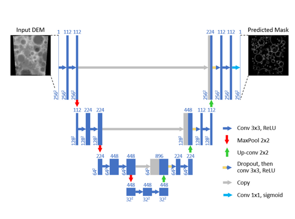
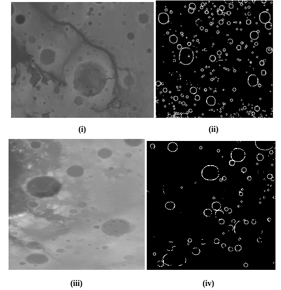
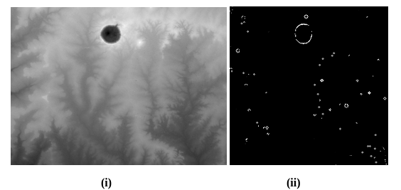

# Crater Detection using Convolutional Neural Netowrks

 <b>Shristi Kumari(BITS Pilani)</b> 

This project containts scripts of a 3 month project at the Indian Space Research Organisation, RRSC (Jodhpur). It contains code for a **U-Net Deep Learning model** for automatically delineating craters on Martian surface. This project aims to alleviate the tedious process of manually marking the craters  which is a mammoth task if it has to cover the entire planetary surface. Using this program the time taken to complete this task will reduce significantly and the efficiency will also improve as human errors will be avoided. 

# Introduction

Identifying impact craters on planetary surfaces is one of the fundamental tasks in planetary science. Manually extracting craters from remotely sensed data is a difficult task because it requires specific knowledge as well as skills of extraction and a great deal of manpower. Hence efficient and effective automatic crater detection method is needed.

Image based crater detection algorithms have inherent limitations on the visibility of the craters as a function of quality of the images and depend on the factors namely illumination, surface properties and atmospheric state. One of the main limitations of running the crater detection algorithms on images is the presence of shadows on the image which depends on the illumination factor. To alleviate this problem **DEM (Digital Elevation Map)** images have been used whuch is a raster data set where each pixel is assigned an elevation value, making them suitable for a quantitative geomorphic analysis as well as automatic crater detection.

# Tools and Technologies Used
The entire program has been coded in **Python-3.5 using Keras, Tensorflow, NumPy, MatplotLib, Cartopy** packages. The model has been trained online using a service provided by Google namely **Google Colab**.

# Data
The dataset consists of images which mainly include DEMs (Digital Elevation Model) of craters from **Mars MGS MOLA Elevation Model 463 m(MEGDR)** which spans **90 and -90 degrees in latitude(and full range in longitude)**. 

## Data Preprocessing

The input data has to be transformed so that uniformity can be maintained in the inputs given to the algorithm. Transformation also leads to the reduction of computation time. The input DEM image has been generated by the following steps:

1. Randomly cropping a square area of the global map of Martian Surface.
2. Downsampling the cropped image to 256×256 pixels.
3. Applying a morphological transform on the image to convert it into an orthographic projection using the **Cartopy Python package** (UK Met. Office, 2015) in order to minimize image distortion
4. Linearly re-scaling the image intensity to boost contrast. 
5. Genrating crater catalogue by storing the pixel coordinates and diameter values of the craters present in the cropped image. 

The position of the cropped region in the 1st step is randomly selected with a uniform distribution, and its length is randomly selected from a log-uniform distribution with minimum and maximum bounds of 500 and 6500 pixels (59 km and 770 km), respectively.

Set containing Image and Crater Catalogue pairs are stored as output from the data preprocessing phase. After this the dataset is split into **Train, Validate and Test data sets** each containing **30,000 image,catalogue pairs**.

# Model Training 

The CNN model is based on **UNET** architecture. The architecture consists of a contracting path (left side) and expansive path (right side), joined through multi-level skip connections (middle). Martian DEM images are input to the contracting path and predictions are output from a final layer following the expansive path. The contacting and expansive paths each contain 3 convolutional blocks. A block in the contracting path consists of **two convolutional layers** followed a **max-pooling layer with a 2x2 pool size**. A block in the expansive path consists of a **2x2 upsampling layer**, a concatenation with the corresponding block from the contracting path (i.e. a merge layer), a **dropout layer**, and two convolutional layers. The connecting path consists of two convolutional layers. Lastly, the final output layer is a 1x1 convolutional layer with a **sigmoid activation** and a single filter to output pixel-wise class scores. In the contracting path, each convolutional layer in blocks **1, 2 and 3 contain 112, 224 and 448 filters**, respectively, while in the expansive path blocks **5, 6 and 7 contain 224, 122 and 122 filters**, respectively. Each convolutional layer in the connecting path contains **448 filters**.

Convolutional neural network (CNN) architecture, based on UNET (Ronneberger et al., 2015). Boxes represent cross-sections of square feature maps. Each map’s dimensions are indicated on its lower left, and its number of channels are indicated above it. Half-grey boxes represent maps for which half of their channels are copied. The leftmost map is a 256×256 grayscale image sampled from the digital elevation map, and the rightmost the CNN’s binary ring mask prediction. Arrows represent operations, specified by the legend - notably, blue arrows represent convolutions, while gray ones represent copying (skip connections).

***Source:- https://arxiv.org/abs/1803.02192***

# Results

Fig 5.1: (i) First input image, (ii) The output image generated by the model. (iii) Second input image, (iv) Output image of (iii) generated by the model.

***Source :- (i) & (iii) MARS MOLA DEM 463m , (ii) & (iv) Both images were generated by the model***

The figures illustrated above represents two random images taken from areas of the DEM the model was not introduced to. The model is able to pick up nearly all the craters present in the image and clearly mark out the boundary of the relatively small craters. It has failed to mark the biggest crater present in the image and a probable reason for reason for it is that the weights connected to a part of the big crater and the weights connected to another part are not able to recognize that they are connected to the same object and thus are not able to join them together. One possible solution for this is to fine tune the model and improve it with more relatively bigger craters in the input dataset.  

Fig 5.2: (i) The input image (ii) Output generated by the model

***Source :- (i) DEM obtained from CARTOSAT satellite data from BHUVAN portal (ii) Image produced by the model***

To check the versatility of the model a DEM image of one of the well preserved craters on Earth that is the Lonar Lake located in Maharashtra, India was given as input to the model. The model was able to identify the crater which can be seen near the top of Fig 5.2. It also marked few other unrelated parts which can be solved by further fine tuning it so it can be familiar with the terrain of Earth as it is very different from MARS and the Moon. 
